# Table of Content
- [Apache Kafka - Wikimedia Recent Changes](#apache-kafka---wikimedia-recent-changesz)
  - [About the project](#about-the-project)
  - [Software Architecture](#software-architecture)
- [Project Output Samples](#project-output-samples)
  - [Topic Dashboard](#topic-dashboard)
  - [Brokers Dashboard](#brokers-dashboard)
  - [Topic Data Visualization](#topic-data-visualization)
  - [Consumer Group](#consumer-group)
  - [Topic Partitions and Replication Factor](#topic-partitions-and-replication-factor)
- [Start Kafka](#start-kafka)
    - [Requirements](#requirements)
  - [Start via the `start.sh` script](#start-via-the-startsh-script)
- [Start Producer](#start-producer)
- [Start Consumer](#start-consumer)

# Apache Kafka - Wikimedia Recent Changes
Welcome to the README.md for the Apache Kafka - Wikimedia Recent Changes project! This repository serves as a comprehensive guide to utilizing Apache Kafka to harness the power of real-time data streaming for monitoring and analyzing recent changes to Wikimedia content. This README.md will provide you with the essential information to get started and make the most of this integration. Explore how Apache Kafka empowers tracks Wikimedia changes. The data is collected from [this API](https://stream.wikimedia.org/v2/stream/recentchange)*(https://stream.wikimedia.org/v2/stream/recentchange)*

## About the project

The Apache Kafka - Wikimedia Recent Changes project is built on a robust architecture designed to efficiently process and analyze real-time data from Wikimedia's recent changes. At its core, this architecture leverages Apache Kafka, utilizing both producers and a consumer group to manage data flow within the `wikimedia.recentchanges` topic. Here's an overview of the key components and technologies that make up this project:

- **Three Brokers**: The system is configured with three Kafka brokers to distribute the workload and provide redundancy, ensuring high availability and fault tolerance.
- **Zookeeper**: Apache ZooKeeper is employed for distributed coordination and management of the Kafka brokers, ensuring system stability and fault recovery.
- **Conduktor Platform Integration**: Conduktor is integrated into the architecture to provide visualization and control capabilities for Apache Kafka. This allows for easier monitoring and management of Kafka topics and data streams. It should open automatically at http://localhost:8080 when stating the scritp
- **Opensearch (formerly known as Elasticsearch)**: The data consumed from the `wikimedia.recentchanges` topic is stored in Opensearch. This powerful search and analytics engine enables efficient data storage, retrieval, and analysis. View the dashboard at http://localhost:5601/app/dev_tools#/console
- **Idempotent Consumers**: To ensure data consistency and prevent duplicate processing, idempotent consumers are implemented. These consumers guarantee that each message is processed exactly once.
- **Opensearch Dashboard**: Data from Opensearch is visualized using a dashboard, providing users with insights and real-time updates on Wikimedia recent changes.
- **Kafka Schema Registry**: Kafka Schema Registry is integrated into the system to manage data schemas. This ensures that data consistency and compatibility are maintained as data flows between producers and consumers.
- **Docker Compose**: The platforms (Kafka, OpenSearch, Conduktor) is containerized and deployed using `docker compose up -d`, with a `docker-compose.yml` file available within the `./kafka-docker/` directory. This facilitates easy deployment and scalability of the Kafka cluster.

In summary, this project's architecture is combination of Apache Kafka, supporting technologies, and containerization. It aims to provide real-time data processing and analysis capabilities for Wikimedia recent changes, making it a powerful tool for monitoring and gaining insights into the dynamic world of Wikimedia content updates.

## Software Architecture
Example of the software architecture of the project (simplified).

# Project Output Samples
Following some images about the project.

## Topic Dashboard

## Brokers Dashboard

## Topic Data Visualization

## Consumer Group

## Topic Partitions and Replication Factor

# Start Kafka
The consumer and producer are both writen in Java. After you cloned the repo you can chose to use `start.sh`.
⚠️ **Make sure docker is running.** ⚠️

### Requirements
- [x] Docker
- [x] Java
- [x] Intellij
- [x] Gradle

## Start via the `start.sh` script
From the terminal just run the command `bash start.sh`.
This command will take a while since there are a lot of images to download.
The script should also open http://localhost:8080/ to view the **Conduktor Platform** to mange and visualize you kafka cluster.

⚠️ **This command should be able to also create the `wikimedia.recentchange` topic.** ⚠️

If creating the topic fails it should still create automatically when the consumer producer begins producing messages.

# Start Producer

Start the producer from intellij like in the image bellow.

# Start Consumer Group

Start the consumer from intellij like in the image bellow.

